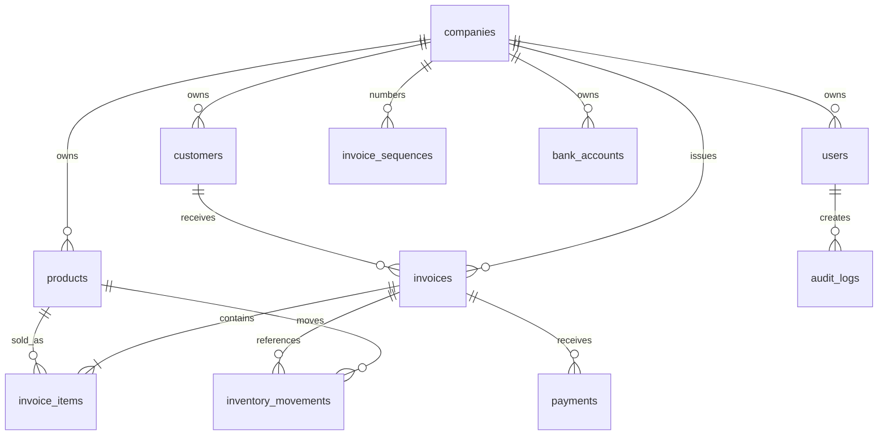

# Database ERD

```mermaid
erDiagram
  companies ||--o{ users : owns
  companies ||--o{ customers : owns
  companies ||--o{ products : owns
  companies ||--o{ invoices : issues
  customers ||--o{ invoices : receives
  invoices ||--|{ invoice_items : contains
  invoices ||--o{ payments : receives
  products ||--o{ invoice_items : sold_as
  products ||--o{ inventory_movements : moves
  invoices ||--o{ inventory_movements : references
  users ||--o{ audit_logs : creates
  companies ||--o{ invoice_sequences : numbers
  companies ||--o{ bank_accounts : owns
```

The Prisma schema is the executable source of truth. Invoice buyer/item fields are snapshots by design; master edits must not rewrite history.

